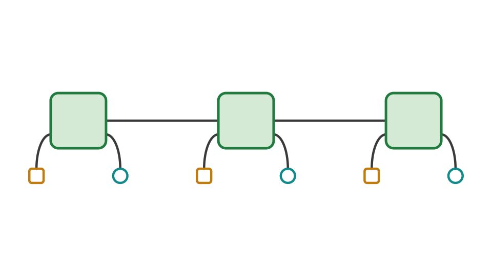
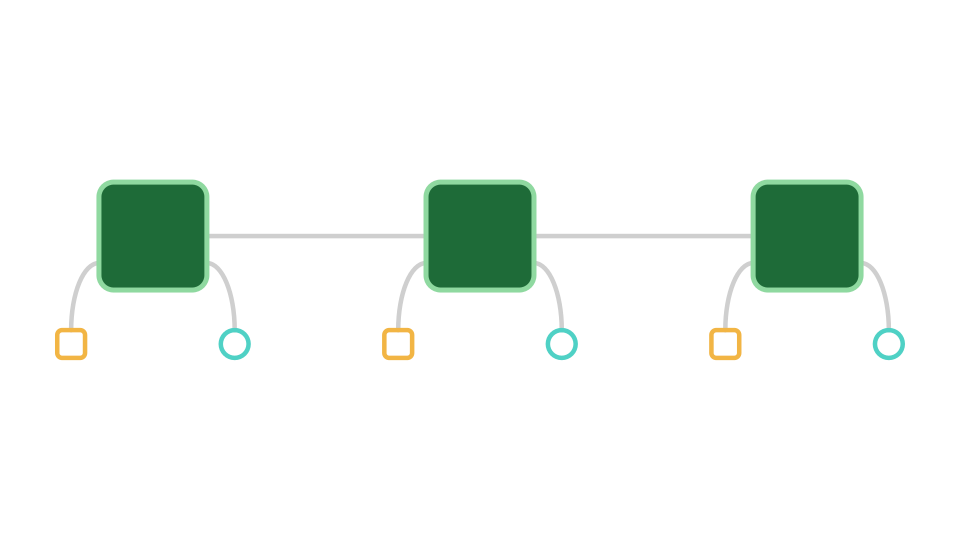
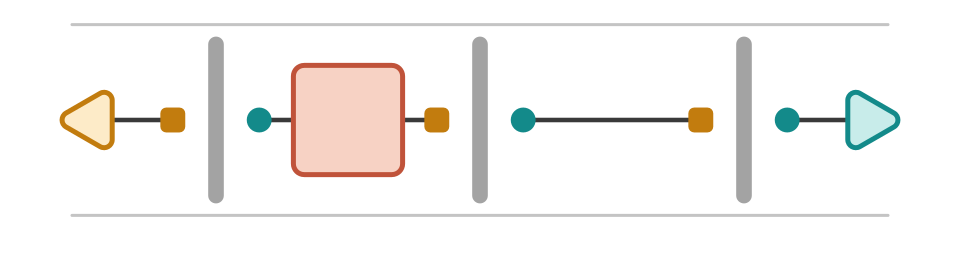
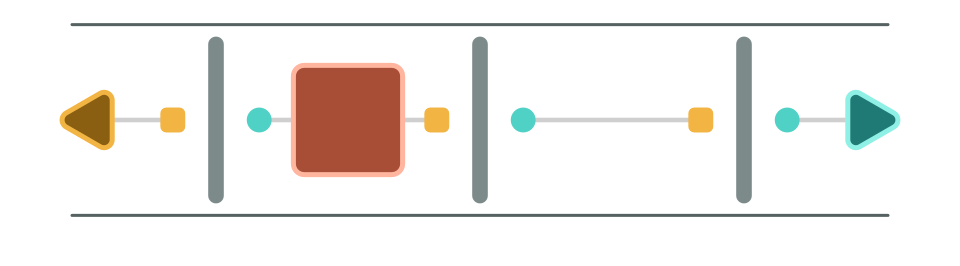

# ProcessTensors.jl

`ProcessTensors.jl` is an ITensor-native framework for studying quantum systems
with environmental memory. Construct a process tensor from a microscopic
environment, then reuse it with different preparations, controls, measurements,
and multi-time probes. 

These tutorials connect the physical picture, tensor-network representation,
and runnable Julia code, helping you learn the process-tensor framework while
using it to design numerical experiments.

## Build once, explore many experiments

When a system interacts with an environment, its present reduced state may not
contain all the information needed to predict its future. The environment can
retain information about earlier interactions and interventions. A process tensor
stores this bath response which can readily be used on various system interventions. 
ProcessTensors.jl  primarily uses MPS/MPO infrastructure to define and manipulate 
process tensors in a memory-efficient way. 

```@raw html
<figure class="feature-clip">
  
  
  
  
  <figcaption><strong>Construct a process tensor:</strong> Compress the influence of multiple environmental modes into a single process tensor MPO using state-of-the-art algorithms.</figcaption>
</figure>

<figure class="feature-clip">
  
  
  
  
  <figcaption><strong>Customize your instruments:</strong> Define the interventions you wish to perform on the system at chosen times; unspecified slots default to identity.</figcaption>
</figure>

<figure class="feature-clip">
  
  
  
  
  <figcaption><strong>Evaluate and reuse:</strong> Contract the same process tensor with different instruments to obtain reduced states and scalar values.</figcaption>
</figure>
```

## Get started

Follow [Installation](installation.md) to set up the package, then choose your learning route depending on what suits you the best

| Your starting point | Suggested route |
| --- | --- |
| **Ready to use process tensors** | [Installation](installation.md), then [Construct your first process tensor](tutorials/process_tensor_singlemode.md) and [Explore a process with instruments](tutorials/process_tensor_instruments.md). Consult the [API reference](api.md) as needed. |
| **Learning the physical framework** | Start with [Process Tensors](theory/process_tensors.md), then [Construct your first process tensor](tutorials/process_tensor_singlemode.md). |
| **New to ITensor or Liouville representations** | Use [ITensor Basics](tutorials/itensor_basics.md), [MPS and MPO Basics](tutorials/mps_mpo_basics.md), and [Liouville-Space Basics](tutorials/liouville_basics.md) for the supporting conventions. |

The foundations explain named ITensor indices, density matrices, and vectorisation.
You can consult them whenever these concepts arise in a process-tensor
calculation. 

For theory and notation, see [Process Tensors](theory/process_tensors.md),
[Quantum States and Liouville Space](theory/liouville_space.md), and
[Tensor Networks in Physics](theory/tensor_networks.md). For progress reporting,
threading, and execution settings, see [Advanced Usage](advanced_usage.md).

## What can you explore?

| Task | Package workflow |
| --- | --- |
| Construct a microscopic process | Define spin or bosonic bath modes and build a `ProcessTensor`. |
| Choose a construction method | Use `Dense()` for small environments or `ACE()` to incorporate and compress independent bath modes. |
| Apply interventions | Assemble preparations, controls, and outcome-resolved operations in an `InstrumentSeq`. |
| Obtain reduced states and statistics | Use `evolve` for trajectories and `evaluate_process` for general contractions. |
| Probe multi-time correlations | Insert operators at different times while retaining the environmental influence. |
| Include an ancillary memory | Use testers to describe experiments with an ancilla carried between interventions. |
| Inspect the temporal representation | Examine input/output legs and memory bonds to understand the stored network. |

`Dense()` retains the full environmental Liouville space. `ACE()` (Automated
Compression of Environments) incorporates initially independent bath modes
sequentially and compresses their temporal influence. 

Gaussian PT-TEMPO and chain-mapped constructions remain development directions.

## Continue with process-tensor workflows

| Goal | Walkthrough |
| --- | --- |
| Construct your first process tensor | [Construct your first process tensor](tutorials/process_tensor_singlemode.md) |
| Probe that process with instruments | [Explore a process with instruments](tutorials/process_tensor_instruments.md) |
| Extend to several bath modes | [Spin-bath process tensor](examples/spin_bath_process_tensor.md) |
| Compress an independent spin environment | [Central-spin dynamics using ACE](examples/central_spin_ace.md) |
| Construct a thermal bosonic environment | [Thermal spin-boson dynamics using ACE](examples/thermal_spinboson_ace.md) |
| Explore repeated measurements and resets | [Ramsey readouts as a probe of bath memory](examples/ramsey_povm.md) |
| Evaluate multi-time operator insertions | [Multi-time correlations](examples/multitime_correlations.md) |
| Use an ancillary tester | [Testers and noisy quantum circuit](examples/noisy_quantum_circuit_tester.md) |

## Additional tools for open quantum dynamics

The package also provides Hilbert- and Liouville-space MPS/MPO objects,
density-matrix conversions, Lindblad generators, and TEBD/TDVP evolution.
These tools support model preparation and reference calculations and can also
be used independently for time-local dynamics.

See [Unitary Dynamics](tutorials/unitary_dynamics.md) for closed-system
evolution and [Dissipative Dynamics](tutorials/dissipative_dynamics.md) for
Markovian open-system evolution. Larger models include a
[dissipative spin chain](examples/dissipative_spin.md) and
[driven-dissipative Bose–Hubbard dynamics](examples/driven_dissipative_bose_hubbard.md).

## Citing and contributing

If you use `ProcessTensors.jl` in research, please cite the
[package repository](https://github.com/Gauthameshwar/ProcessTensors.jl) and the
relevant methods and theory references linked in the documentation.

Bug reports, questions, new examples, and algorithm contributions are welcome.
Visit the [issue tracker](https://github.com/Gauthameshwar/ProcessTensors.jl/issues)
for questions and feedback, or read the
[contribution guidelines](https://github.com/Gauthameshwar/ProcessTensors.jl/blob/main/CONTRIBUTING.md)
to get involved.
