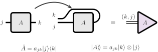
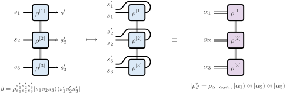
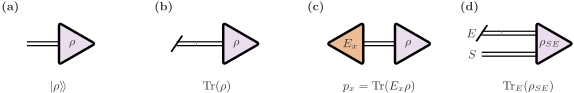

# Quantum States and Liouville Space

Process tensors connect quantum operations across time. Liouville space provides a common representation for their ingredients: density operators become vectors, operations act as linear maps, and traces or measurement probabilities become contractions. This page introduces the conventions used throughout `ProcessTensors.jl`.

Vectorisation changes how an operator is represented, while preserving its information. It does not require a Markovian approximation or a master equation. The same language describes states, interventions, and the open system legs of a process tensor.

For the tensor-network vocabulary used below, see [Tensor Networks in Physics](tensor_networks.md). Short package previews connect the definitions to code; the complete worked examples are in [Liouville-Space Basics](@ref).

## Density operators and reduced states

A quantum state is described by a density operator $\rho$ on a Hilbert space $\mathcal H$. A normalised physical state satisfies

```math
\rho^\dagger=\rho,\qquad \rho\geq0,\qquad \operatorname{Tr}(\rho)=1.
```

A pure state has $\rho=|\psi\rangle\langle\psi|$. More generally,

```math
\rho=\sum_a p_a|\psi_a\rangle\langle\psi_a|,
\qquad p_a\geq0,\qquad \sum_a p_a=1,
```

where the constituent states are normalised. The ensemble decomposition is generally not unique: different preparations can produce the same density operator and therefore the same measurement statistics. For a Hermitian observable $O$, its expectation is $\langle O\rangle=\operatorname{Tr}(O\rho)$.

For a system $S$ coupled to an environment $E$, the joint state acts on $\mathcal H_S\otimes\mathcal H_E$. The **reduced state**

```math
\rho_S=\operatorname{Tr}_E(\rho_{SE})
```

contains everything needed to predict measurements on the system at that time:

```math
\operatorname{Tr}_S(O_S\rho_S)
=\operatorname{Tr}_{SE}\bigl[(O_S\otimes I_E)\rho_{SE}\bigr].
```

Even when $\rho_{SE}$ is pure, $\rho_S$ can be mixed because the system is entangled with its environment. Mixedness need not arise from uncertainty about which pure state was prepared. Furthermore, the reduced state alone generally does not determine the response to later interventions: correlations with the environment can affect what happens next. Process tensors retain the multi-time response needed for such questions.

!!! info "In the package"
    ```julia
    ρ = to_dm(ψ)
    ρ_mix = to_dm([ψ_a, ψ_b]; coeffs=[0.7, 0.3])
    ```

    These construct Hilbert-space density MPOs from compatible MPS states. See [MPS and MPO Basics](@ref) for state preparation and reduced density matrices.

## Operators as Liouville-space vectors

The linear operators on a $d$-dimensional Hilbert space form a $d^2$-dimensional vector space. Equipped with the **Hilbert–Schmidt inner product**, this is itself a Hilbert space:

```math
\langle\!\langle A|B\rangle\!\rangle
=\operatorname{Tr}(A^\dagger B).
```

We call it Liouville space. Density operators, observables, and non-Hermitian operators all belong to this space. The notation $|A\rangle\!\rangle$ denotes the vector representation of an operator $A$.

### Column-major vectorisation

The package uses column-major ordering, consistent with Julia's array convention. If $A_{jk}=\langle j|A|k\rangle$, then

```math
|A\rangle\!\rangle=\operatorname{vec}(A)
=\sum_{j,k}A_{jk}|k\rangle\otimes|j\rangle.
```

The row index $j$ changes fastest. For example,

```math
A=\begin{pmatrix}a_{11}&a_{12}\\a_{21}&a_{22}\end{pmatrix}
\quad\longmapsto\quad
|A\rangle\!\rangle=
\begin{pmatrix}a_{11}\\a_{21}\\a_{12}\\a_{22}\end{pmatrix}.
```

The basis here is fixed throughout. The two factors record the original column and row indices; they do not introduce a second physical system.



The bend rearranges indices. It does not complex-conjugate the operator. The fused leg is labelled $(k,j)$, in the same order as the column-major vector above.

### Local vectorisation of a many-body operator

For a density MPO, vectorisation can be performed one site at a time. At site $j$, the local ket and bra legs combine into a Liouville index of dimension $d_j^2$. The resulting object is an MPS in operator space. This local fusion leaves the existing virtual bonds unchanged; compression, if performed afterwards, is a separate operation.

There is a small ordering distinction when comparing dense arrays. Vectorising the full many-body matrix groups all column indices and then all row indices. Local fusion groups each site's column–row pair together. The two arrangements are related by a fixed permutation of indices. Dense matrices and vectors must use the same arrangement before their entries can be compared.



!!! info "In the package"
    ```julia
    sites_L = liouv_sites(sites)
    ρL = to_liouville(ρ; sites=sites_L)
    ```

    `ρ` is a Hilbert-space density MPO; `ρL` represents the same operator as a Liouville MPS. Reuse these exact `sites_L` indices when constructing objects that will contract with it. Matching dimensions and tags alone do not make independently created indices identical.

## Traces, observables, and measurement effects

Vectorisation makes physical outputs ordinary inner products. The vectorised identity is

```math
|I\rangle\!\rangle=\sum_j|j\rangle\otimes|j\rangle,
\qquad
\langle\!\langle I|A\rangle\!\rangle=\operatorname{Tr}(A).
```

Contracting an open Liouville leg with $\langle\!\langle I|$ therefore traces out that subsystem. Applied to the environment legs of a joint state, this gives the partial trace and leaves the system legs open.

For a Hermitian observable $O$,

```math
\langle O\rangle
=\operatorname{Tr}(O\rho)
=\langle\!\langle O|\rho\rangle\!\rangle.
```

For a general operator $A$, the corresponding identity is $\operatorname{Tr}(A\rho)=\langle\!\langle A^\dagger|\rho\rangle\!\rangle$. The dagger matters because a Hilbert–Schmidt inner product conjugates its first argument.

A measurement outcome is associated with a positive **effect** $E_x$, with $\sum_xE_x=I$ for a complete measurement. Its probability is

```math
p_x=\operatorname{Tr}(E_x\rho)
=\langle\!\langle E_x|\rho\rangle\!\rangle.
```

An effect specifies the outcome probability. To describe the state after that outcome, we need an operation as well, introduced in the next section.



Leaving the leg open retains $|\rho\rangle\!\rangle$. Closing it with the identity gives the trace, and closing it with $E_x$ gives $p_x$. Tracing only the environment leaves the system leg open.

!!! info "In the package"
    ```julia
    Id_L = to_liouville(Id_mpo; sites=sites_L)
    O_L = to_liouville(O_mpo; sites=sites_L)
    trace_ρ = inner(Id_L, ρL)
    mean_O = inner(O_L, ρL)
    ```

    Here `Id_mpo` is the identity and `O_mpo` is a Hermitian observable on the same Hilbert sites as `ρ`. See [Liouville-Space Basics](@ref) for their construction.

### Trace normalisation and purity

A density operator has unit trace, but its Liouville vector generally does not have unit Euclidean norm:

```math
\langle\!\langle I|\rho\rangle\!\rangle=1,
\qquad
\|\,|\rho\rangle\!\rangle\,\|_2^2
=\operatorname{Tr}(\rho^2).
```

The second quantity is the **purity**. It equals one for a pure state and $1/d$ for the maximally mixed state $I/d$. Consequently, normalising a mixed-state Liouville MPS to unit Euclidean norm changes its physical trace. State normalisation must use the trace instead.

## Operations as Liouville-space maps

A linear operation $\Phi$ acting on operators has a matrix representation $S_\Phi$ in Liouville space:

```math
|\Phi(A)\rangle\!\rangle=S_\Phi|A\rangle\!\rangle.
```

An input Hilbert dimension $d_{\mathrm{in}}$ and output dimension $d_{\mathrm{out}}$ give Liouville dimensions $d_{\mathrm{in}}^2$ and $d_{\mathrm{out}}^2$. Such maps need not be square.

### Left and right multiplication

The column-major convention gives the identity

```math
\operatorname{vec}(A\rho B)
=(B^{\mathsf T}\otimes A)\operatorname{vec}(\rho).
```

Indeed, $(A\rho B)_{jk}=\sum_{m,n}A_{jm}\rho_{mn}B_{nk}$, which is exactly the component action of $B^{\mathsf T}\otimes A$ in the chosen ordering. The transpose records this rearrangement; it is not a physical transpose operation performed on the state.

| Hilbert-space action | Liouville matrix | Package suffix |
|:--|:--|:--|
| $A\rho$ | $I\otimes A$ | `_L` |
| $\rho A$ | $A^{\mathsf T}\otimes I$ | `_R` |
| $A\rho A^\dagger$ | $A^*\otimes A$ | `_Jump` |
| $A^\dagger A\rho$ | $I\otimes A^\dagger A$ | `_LdagL_L` |
| $\rho A^\dagger A$ | $(A^\dagger A)^{\mathsf T}\otimes I$ | `_LdagL_R` |

Here $*$ denotes entrywise complex conjugation. The suffixes refer to multiplication of the original operator, not to the visual position of a tensor leg. For a many-body network, these rules are applied with the local index ordering described above.

!!! info "In the package"
    ```julia
    os = OpSum()
    os += -1.0im, "Sx_L", 1
    os +=  1.0im, "Sx_R", 1
    ```

    These terms encode $-i[S_x,\rho]$. See [Liouville-Space Basics](@ref) for assembling superoperator `OpSum`s into Liouville MPOs.

### Channels and outcome-conditioned operations

A quantum channel is a completely positive, trace-preserving linear map. Complete positivity means that positivity is preserved even when the map acts on one part of a larger system. In finite dimensions, a channel admits a Kraus representation

```math
\Phi(\rho)=\sum_a K_a\rho K_a^\dagger,
\qquad \sum_aK_a^\dagger K_a=I,
\qquad S_\Phi=\sum_a K_a^*\otimes K_a.
```

Trace preservation becomes

```math
\langle\!\langle I_{\mathrm{out}}|S_\Phi
=\langle\!\langle I_{\mathrm{in}}|.
```

For a particular measurement outcome $x$, an operation $\mathcal A_x$ is completely positive and trace-nonincreasing:

```math
\mathcal A_x(\rho)=\sum_aK_{x,a}\rho K_{x,a}^\dagger,
\qquad E_x=\sum_aK_{x,a}^\dagger K_{x,a}\leq I.
```

Its output is the unnormalised conditional state $\widetilde\rho_x=\mathcal A_x(\rho)$. Its trace gives $p_x$, and the normalised conditional state is $\rho_x=\widetilde\rho_x/p_x$ when $p_x>0$. A complete instrument is a collection of such outcome maps whose sum is trace preserving. Different instruments can have the same effects while producing different post-measurement states.

The unnormalised maps are linear. Dividing by an outcome probability is generally nonlinear in the input state, so normalisation is performed after the linear contraction when a conditional state is wanted.

### Markovian generators

Liouville space also represents time-local density-matrix dynamics. In units with $\hbar=1$, the Hamiltonian generator is

```math
\mathcal L_H=-i(I\otimes H-H^{\mathsf T}\otimes I),
\qquad \frac{d}{dt}|\rho\rangle\!\rangle=\mathcal L_H|\rho\rangle\!\rangle.
```

For a time-independent GKLS generator with rates $\gamma_\mu\geq0$,

```math
\mathcal L=\mathcal L_H+\sum_\mu\gamma_\mu
\left[
L_\mu^*\otimes L_\mu
-\frac12 I\otimes L_\mu^\dagger L_\mu
-\frac12(L_\mu^\dagger L_\mu)^{\mathsf T}\otimes I
\right],
\qquad S_{\Phi_t}=e^{t\mathcal L}.
```

A generator obeys $\langle\!\langle I|\mathcal L=0$, whereas its trace-preserving propagator obeys $\langle\!\langle I|S_{\Phi_t}=\langle\!\langle I|$. The generator is not itself a channel. The GKLS form also does not, by itself, specify a local or global master-equation derivation; that distinction concerns how the Hamiltonian, jump operators, and rates were obtained.

!!! info "In the package"
    ```julia
    L_mpo = liouvillian_mpo(H, sites_L)
    ```

    For a Hamiltonian `OpSum` `H`, this builds the commutator generator, including its factor of $-i$. See [Unitary Dynamics](@ref) and [Dissipative Dynamics](@ref) for propagation and jump-operator examples.

## Related material and further reading

!!! related "Continue learning"
    | Goal | Page |
    |:--|:--|
    | Practise vectorisation, overlaps, and maps | [Liouville-Space Basics](@ref) |
    | Understand the multi-time description | [Process Tensors](process_tensors.md) |
    | Construct a reusable process | [Construct a process tensor](@ref) |
    | Apply interventions and measurements | [Process tensor instruments](@ref) |
    | Use time-local evolution tools | [Unitary Dynamics](@ref) and [Dissipative Dynamics](@ref) |

For more background:

- John Preskill, [Lecture Notes for Quantum Computation](https://theory.caltech.edu/~preskill/ph229/), Chapters 2 and 3: density operators, measurements, and quantum operations.
- J. A. Gyamfi, [Fundamentals of Quantum Mechanics in Liouville Space](https://arxiv.org/abs/2003.11472): operator-space methods and vectorisation conventions.
- Mark M. Wilde, [Quantum Information Theory](https://arxiv.org/abs/1106.1445): channels, instruments, and the Choi representation.
